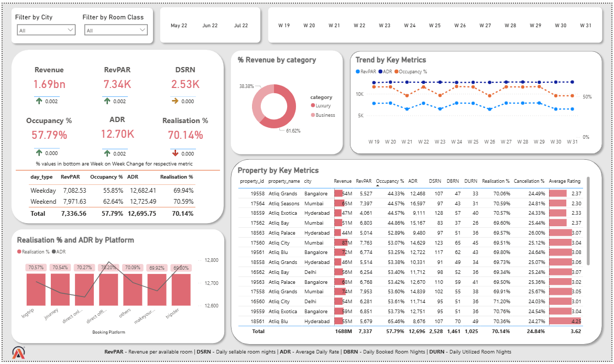

# AtliQ Grands – Hospitality Revenue Analytics Dashboard (Power BI)

## 📊 Project Overview
AtliQ Grands is a chain of luxury and business hotels across India. Due to increased competition and suboptimal revenue decisions, the organization is facing a decline in revenue and market share.

This project presents a **Level-1 Revenue Analytics Dashboard** built using **Power BI**, designed to support the revenue management team with data-driven insights across pricing, occupancy, and booking performance.

---

## 🎯 Business Objectives
- Monitor overall revenue performance and trends
- Analyze occupancy and capacity utilization
- Evaluate pricing effectiveness using ADR and RevPAR
- Understand booking behavior across channels
- Compare weekday vs weekend demand patterns
- Identify high and low performing properties

---

## 📁 Dataset Description
The data follows a **star schema** and includes:
- `dim_date` – Calendar, week, and day-type information
- `dim_hotels` – Property and city details
- `dim_rooms` – Room categories
- `fact_bookings` – Transaction-level booking data
- `fact_aggregated_bookings` – Daily room capacity and utilization

---

## 📌 Key Metrics
- Revenue
- Occupancy %
- ADR (Average Daily Rate)
- RevPAR (Revenue per Available Room)
- DSRN / SRN
- Realisation %
- Week-on-Week % Change

---

## 🧠 Dashboard Features
- KPI cards with Week-on-Week indicators
- City and Room Class slicers
- Monthly and Weekly time slicers
- Weekday vs Weekend performance analysis
- Channel-level ADR and Realisation comparison
- Property-level performance table with conditional formatting
- Weekly trend analysis for key revenue metrics

---

## 📷 Dashboard Preview

---

## 🛠 Tools & Technologies
- Power BI
- DAX
- Data Modeling (Star Schema)
- Hospitality Domain KPIs

---

## 📈 Key Insights
- Luxury hotels contribute the majority of overall revenue.
- Weekend occupancy is higher than weekdays, indicating leisure-driven demand.
- Certain booking platforms generate higher ADR but suffer from lower realization.
- Revenue and RevPAR show noticeable week-on-week volatility.

---

## 🚀 Future Enhancements
- Cancellation impact analysis
- Forecasting demand using historical trends
- Price optimization and what-if analysis
